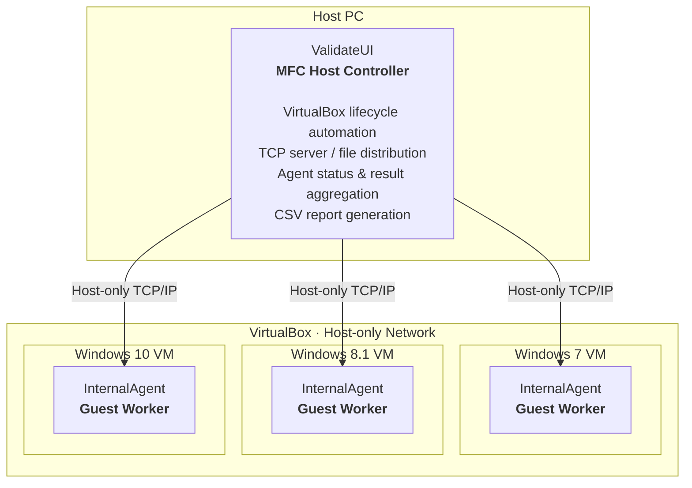

# Recovery Tool Validation System

**C++ · MFC · Win32 API · Winsock · VirtualBox · Multi-threading**

2019년에 만든 **Windows 복구 도구 검증 자동화 Proof of Concept**입니다.  
격리된 VirtualBox 환경에서 테스트 전후의 파일 상태를 비교하고, 복구 도구 실행 후 원본 상태로 얼마나 돌아왔는지 여러 Windows 버전에서 확인하도록 구성했습니다.

> **Security context**  
> 이 저장소는 방어 목적의 과거 보안 자동화 프로젝트를 보존한 것입니다. 포트폴리오 정리본에는 테스트용 실행 파일을 포함하지 않으며, 원래 설계 역시 외부 네트워크와 분리된 가상 환경을 전제로 했습니다.

## System Overview

`ValidateUI`가 호스트에서 VirtualBox VM과 TCP 연결을 관리하고, 각 VM의 `InternalAgent`가 파일 상태 측정과 검증 작업을 수행합니다.

## Validation Flow

1. VirtualBox VM을 시작하고 Agent 연결을 기다립니다.
2. Agent가 검증 전 파일 목록과 해시를 기준 상태로 기록합니다.
3. Host가 테스트 대상과 복구 도구를 Agent에 전달합니다.
4. Agent가 격리된 VM에서 각 단계를 실행하고 파일 변경을 감지합니다.
5. 실행 전/후의 파일 이름과 해시를 비교해 변경 및 복구 결과를 계산합니다.
6. Host가 Windows 버전별 상태와 로그를 수집하고 CSV 보고서를 생성합니다.
7. 검증 종료 후 VM을 종료하고 `Recovery` snapshot으로 되돌립니다.

## Engineering Highlights

| Area | Implementation |
| --- | --- |
| **VM automation** | `VBoxManage.exe`를 호출해 VM 시작, 종료, snapshot 복원을 자동화 |
| **Multi-agent orchestration** | Winsock TCP 서버와 Agent별 worker thread로 여러 Windows VM 연결 관리 |
| **Custom command protocol** | `READY → SEND → RUN → LOG → STOP` 단계의 명령/응답 흐름 정의 |
| **File transfer** | Win32 `TransmitFile`, `CreateFile`, `ReadFile`, `WriteFile` 기반 파일 송수신 |
| **File-state comparison** | 파일명과 MD5 값을 `std::map`으로 저장해 실행 전후 상태 비교 |
| **Process lifecycle** | `CreateProcess`, Event, Thread, timeout을 이용해 Guest 작업 실행 및 종료 관리 |
| **Result reporting** | Windows 버전별 명령 로그와 비교 결과를 CSV로 출력 |

## Components

### [ValidateUI — Host Controller](./ValidateUI/README.md)
MFC 기반의 호스트 애플리케이션입니다. VirtualBox 제어, TCP 서버, 파일 배포, VM별 상태 표시와 결과 수집을 담당합니다.

### [InternalAgent — Guest Validation Agent](./InternalAgent/README.md)
각 Windows VM 내부에서 실행되는 콘솔 Agent입니다. Host 명령을 처리하고 파일 상태 측정, 프로세스 실행, 결과 비교 및 보고를 담당합니다.

## Tech Stack

- **Language:** C++
- **Desktop UI:** MFC
- **Windows:** Win32 API, Windows CryptoAPI
- **Networking:** Winsock 2 / TCP
- **Concurrency:** Win32 Thread, Event, Critical Section, MFC worker thread
- **Virtualization:** Oracle VirtualBox / `VBoxManage`
- **Development Environment:** Visual Studio 2015 (Visual Studio 14)

## Historical Documentation

당시 실제 운영을 기준으로 작성한 자료도 함께 보존하고 있습니다.

- [사용자 메뉴얼](./ValidateUI/manual/사용자메뉴얼.md)
- [운영 및 설치 메뉴얼](./ValidateUI/manual/운영자설치메뉴얼.md)
- [원본 데이터 흐름도](./ValidateUI/manual/OPER_flowchart.jpg)

## Prototype Limitations

이 프로젝트는 **2019년 학습/검증용 prototype**이며 현재의 production 시스템을 의미하지 않습니다.

- VM 이름, snapshot 이름, 네트워크 endpoint 등 일부 환경 값이 코드에 고정되어 있습니다.
- TCP 메시지는 C/C++ 구조체를 직접 전달하는 방식으로, 별도의 versioned serialization·authentication·encryption 계층이 없습니다.
- MD5는 여기서 파일 상태 비교 식별자로 사용되었으며 현대적인 보안 검증용 hash 선택은 아닙니다.
- VirtualBox 5.x와 구형 Windows VM 환경을 전제로 하므로 현재 환경에서 바로 실행되는 것을 보장하지 않습니다.

원래 저장소 상태는 `archive/pre-cleanup-2026-08-21` 브랜치에 보존되어 있습니다.
