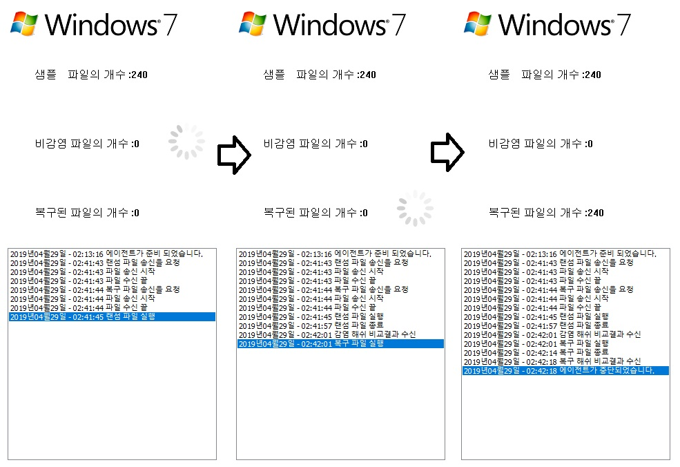

# ValidateUI — Host Controller

`ValidateUI`는 Recovery Tool Validation System의 **호스트 측 MFC 컨트롤러**입니다.

VirtualBox VM의 lifecycle을 관리하고, 각 VM에서 실행되는 `InternalAgent`와 TCP로 통신하며 테스트 파일 전달, 상태 표시, 결과 수집과 CSV 보고서 생성을 담당합니다.



## Responsibilities

- VirtualBox에 등록된 Windows VM 목록 확인
- 선택한 VM 시작 / 종료 / `Recovery` snapshot 복원
- TCP 서버 기동 및 여러 Agent 연결 관리
- 테스트 대상과 복구 도구를 연결된 Agent에 전송
- Agent별 명령 상태와 Windows 버전을 UI에 표시
- 실행 결과를 버전별 로그로 저장
- `Report07.csv`, `Report08.csv`, `Report10.csv` 형태의 결과 보고서 생성

## Key Implementation

### VirtualBox lifecycle automation

`VBoxController.cpp`에서 VirtualBox의 `VBoxManage.exe` 명령을 조합해 다음 작업을 수행합니다.

```text
list vms
startvm <VM> --type headless
controlvm <VM> poweroff
snapshot <VM> restore "Recovery"
```

VirtualBox 작업은 별도 MFC worker thread에서 메시지를 받아 실행하도록 구성했습니다.

### TCP server and multi-agent handling

`MySocket.cpp`에서 Winsock 서버를 열고 Agent 연결을 `accept`합니다. 연결된 socket은 목록으로 관리하며, 각 Agent 처리는 별도 worker thread로 넘깁니다.

Agent가 보내는 Windows 버전 정보에 따라 Win7 / Win8.1 / Win10 UI와 로그 저장소를 분리합니다.

### Command-driven workflow

Host와 Agent 사이에는 공통 protocol header를 두고 단계별 command를 주고받습니다.

```text
READY
  ↓
SEND_SAMPLE
  ↓
SEND_TOOL
  ↓
RUN_SAMPLE
  ↓
LOG_SAMPLE
  ↓
RUN_TOOL
  ↓
LOG_TOOL
  ↓
STOP
```

Host는 수신된 상태를 기반으로 다음 command를 전송하고 UI 상태를 갱신합니다.

### File distribution

Win32 `TransmitFile`을 사용해 연결된 Agent에 파일 metadata와 파일 데이터를 전달합니다. 여러 VM이 연결된 경우 같은 입력을 각 Agent에 배포합니다.

### Reporting

`ValidateUIDoc.cpp`는 Agent에서 수집한 command log와 파일 비교 수치를 Windows 버전별 `CPtrList`에 저장하고, 검증 종료 시 CSV로 export합니다.

## Important Files

| File | Role |
| --- | --- |
| `ValidateUI/ValidateUI.cpp` | 애플리케이션 초기화, Agent worker thread, command 처리 |
| `ValidateUI/MySocket.cpp` | TCP server, Agent socket 관리, command/file 전송 |
| `ValidateUI/VBoxController.cpp` | VirtualBox CLI 제어 |
| `ValidateUI/ControlDlg.cpp` | VM 선택, 실행/초기화, 검증 workflow 시작 |
| `ValidateUI/ValidateUIDoc.cpp` | 로그 저장과 CSV 보고서 생성 |
| `ValidateUI/MyAppProtocol.h` | Host-Agent command / data structure 정의 |

## Historical Environment

- Visual Studio 2015 / Visual Studio 14
- MFC
- Winsock 2
- Oracle VirtualBox 5.x
- Windows 7 / 8.1 / 10 guest VM

## Limitations

이 코드는 2019년 prototype입니다.

- VM 및 snapshot naming convention에 의존합니다.
- 네트워크 protocol은 구조체 직접 송수신 방식입니다.
- 일부 UI synchronization과 오류 처리는 production 수준으로 일반화되어 있지 않습니다.
- 현대 환경에서 재사용하려면 VirtualBox integration과 protocol layer의 재설계가 필요합니다.

[← System Overview](../README.md)
