복구도구 검증 소프트웨어 사용자 메뉴얼
=====

# 1. 복구도구 검증 소프트웨어란?
 다양한 운영체제 환경에서 랜섬웨어의 복구도구 를 검증하는 소프트웨어다.

# 2. 소프트웨어 사용전 점검사항
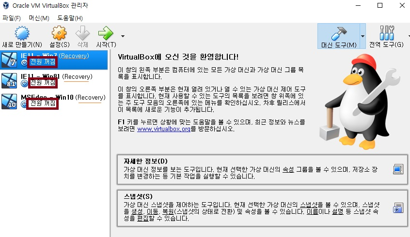
 복구 소프트웨어와 같이 설치된 버츄얼 박스를 실행하여 붉은 박스와 같이 전원 꺼짐을 확인하고 스냅샷 이름을 확인하여 상단의 이미지와 다르면 운영자에게 문의한다.(ex 스냅샷복구중 혹은 스냅샷 이름이 다른경우)
 
 각각의 이미지의 이름은 IE11 - Win7, IE11 - Win81, MSEdge - Win10 이다. 
 스냅샷의 이름을 Recovery이다.

# 3. 소프트웨어 사용 순서
## 3.1 프로그램 기동
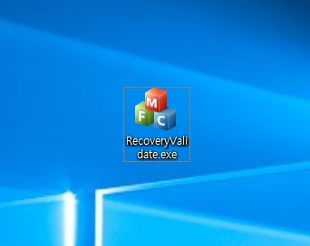

 제공받은 검증 프로그램을 실행합니다.

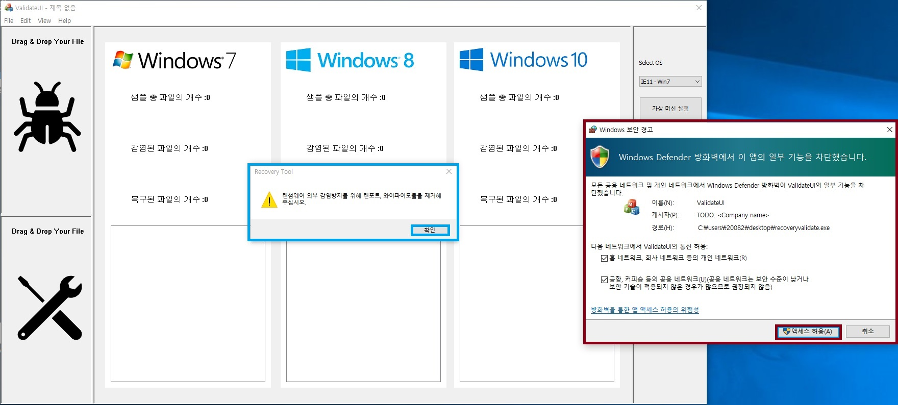

 초기 기동시에는 붉은창과 같이 방화벽 설정을 지정해줘야됩니다.
 두군데 체크한뒤 엑세스 허용을 클릭합니다.

 파란 경고창에 나온것 처럼 랜섬웨어가 실행컴퓨터와 연결된 내부망을 감염 시킬수 잇기 때문에 물리적인 RJ42포트 혹은 와이파이 망에서 컴퓨터를 연결해제 시킵니다.
## 3.2 가상머신 기동
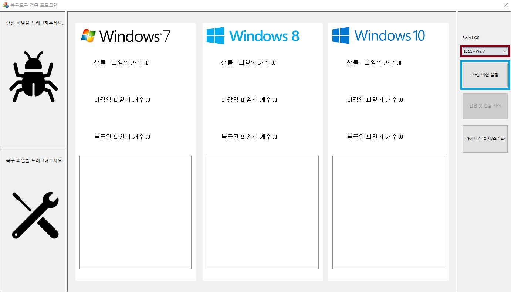

 우측 빨간박스 위치의 목록을 클릭하면 다음과 같이 운영체제 목록을 볼수 있다.

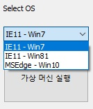

 알맞는 가상머신을 선택한후 파란박스 위치의 가상머신 실행버튼을 클릭한다. 다중 운영체제 검증이 필요한 경우 위 순서를 반복한다.

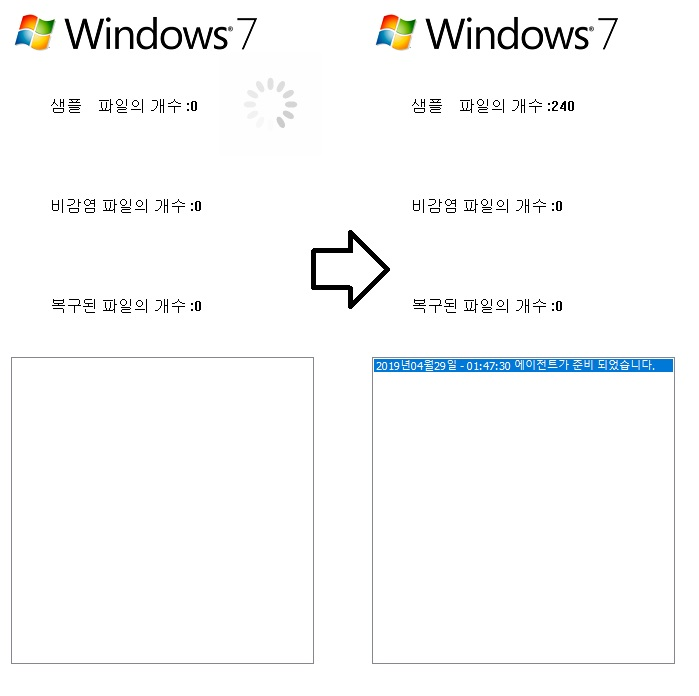

 가운데 상태장에 변화를 확인한다. 로그창에 다음과 같은 문구가 나오면 가상머신이 기동된것이다.

 상단에 샘플 파일의 개수 에서 감염전 파일의 수를 알수 있다.
## 3.3 샘플 및 복구도구 입력
가상 머신기동이 확인된 후에는 파일 입력을 준비한다. 

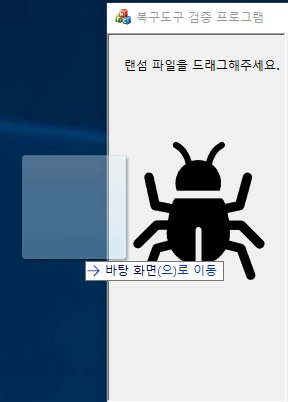

 드래그로 샘플파일을 끌고와서 해당 그림영역에서 놓아준다. 

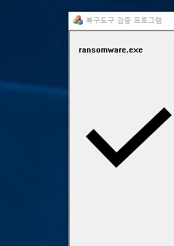

 확장자가 exe로 끝나는 파일을 입력했다면 다음과 같이 그림이 전환된다.

 복구도구도 같은 방식으로 하단 영역에 입력한다.
## 3.4 파일 전송및 검증시작

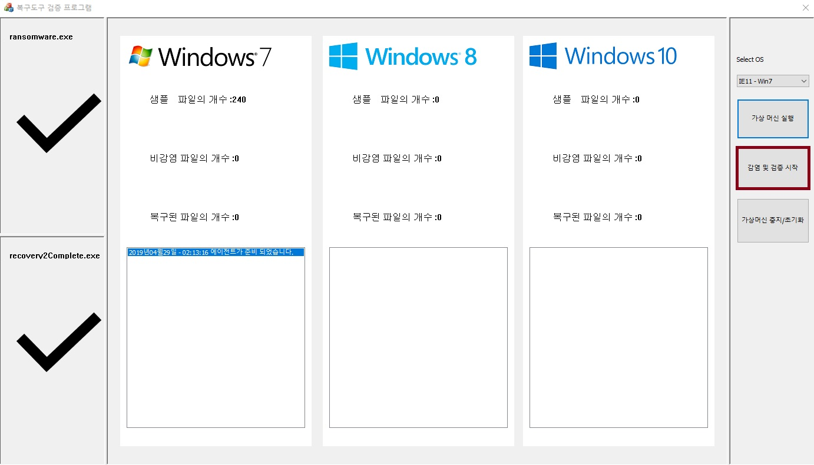

 이제 우측에 빨간박스 영역이 활성화된것을 확인한뒤 감염 및 검증시작 버튼을 클릭하면 파일 전송및 검증이 시작된다. 

 검증 과정을 상단 이미지와 같이 진행된다.

## 3.5 검증 종료

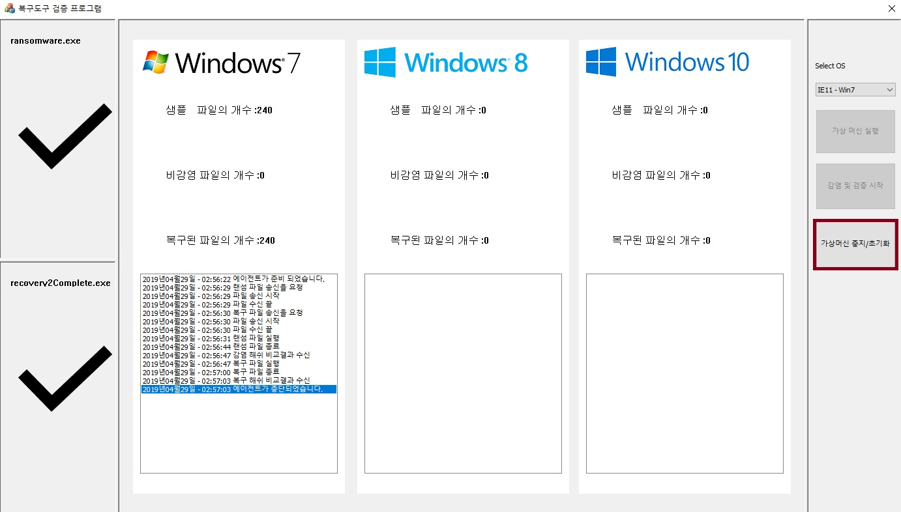

 검증이 종료되면 우측 빨간 박스위치의 중지/초기화 버튼을 클릭하여 검증을 마무리합니다 
 그후 검증 프로그램을 종료시킵니다.

# 4. 보고서 출력내용
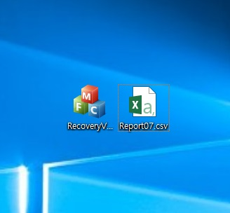

 검증 프로그램을 종료하고나면 보고서 csv파일이 생성됩니다.

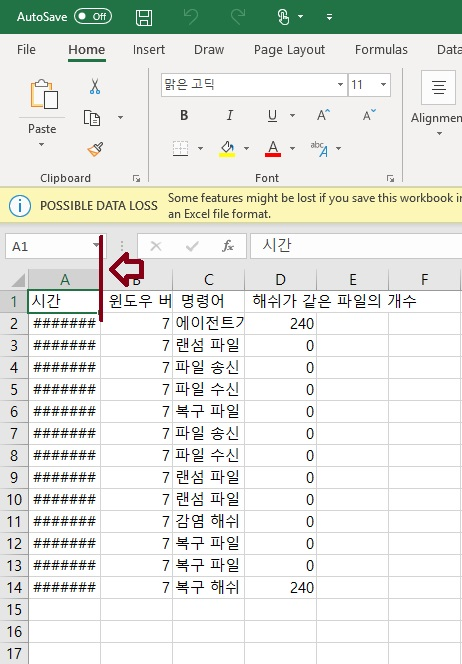 

 csv 파일을 엑셀로 실행할경우 열의 크기를 수정해줘야 시간이 보입니다. 상잔의 빨간 화살표 부분을 클릭후 드래그하면 열의 크기를 수정할수 있습니다. 기호에 맞게 적절히 수정합니다.

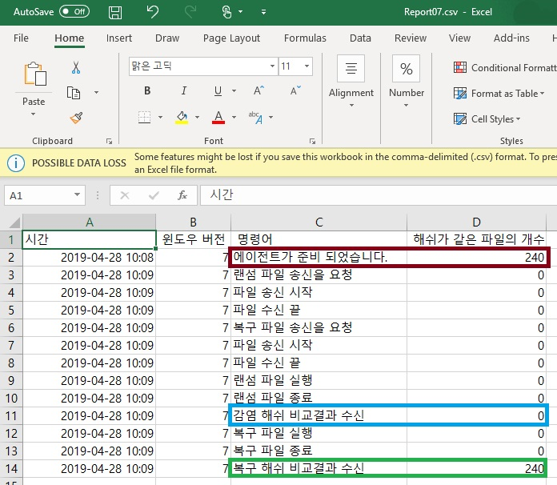 

 기본적으로 보고서는 각단계의 해시 파일의 개수를 포함하고 있습니다. 

    빨간 박스 영역의 해시 개수는 감염전 파일의 해시 개수를 의미합니다. 

    파란 박스 영역의 해시 개수는 감염후 해시와 감염전 해시를 비교한후 같은 해시의 파일 개수를 의미합니다. 
    즉 감염되지 않은 파일이 존재할경우 0이 아닌 양수로 표기됩니다.
    
    녹색 박스 영역의 해시 개수는 복구후 해시와 감염전 해시를 비교한후 같은 해시의 파일 개수를 의미합니다. 
    즉 복구되지 않은 파일이 존재할경우 감염전 파일의개수와 다른 값을 가집니다. 
 상단의 그림은 모든 파일이 복구된후의 출력된 결과입니다. 

# 5. 오류 발생시 대처방법

파일 전송 이후 진행에 변화가 없을 경우:

     가상머신 중지/초기화 버튼을 누르고 다시 기동시킵니다.

파일 전송 단계에서 오류가 생길경우:

    가상머신과 복구도구 사이의 통신의 문제가 생긴 경우이다. 이때는 해당 컴퓨터를 재시작하여 네트워크 환경을 초기화 시켜준다.

모든 단계를 거친후 해결되지 않는 경우:

    오류시점시 스크린샷을 저장하여 운영자에게 문의한다. 스크린샷 찍는 법은 윈도우키 + PrtScnSysRq 키를 동시에 누른다. 이후 문서>사진>스크린샷 폴더에 스크린샷이 저장된다.
