복구도구 검증 소프트웨어 운영및 설치 메뉴얼
=====

# 1. 목적
 검증 도구의 설치와 운영에 관련된 정보를 제공하기 위함입니다.

# 2. 대상자
 소프트웨어 운영과 관리 자격을 갖춘 담당자를 위한 메뉴얼입니다. 일반적으로 컴퓨터에 대한 이해 기반을 알고 있다는 가정으로 작성되었습니다.

 소프트웨어 작동을 위해 제공된 설치 방법을 반드시 지켜야합니다. 순서변경으로 인해 문제가 발생할수 있습니다.

## 2.1 데이터 흐름도
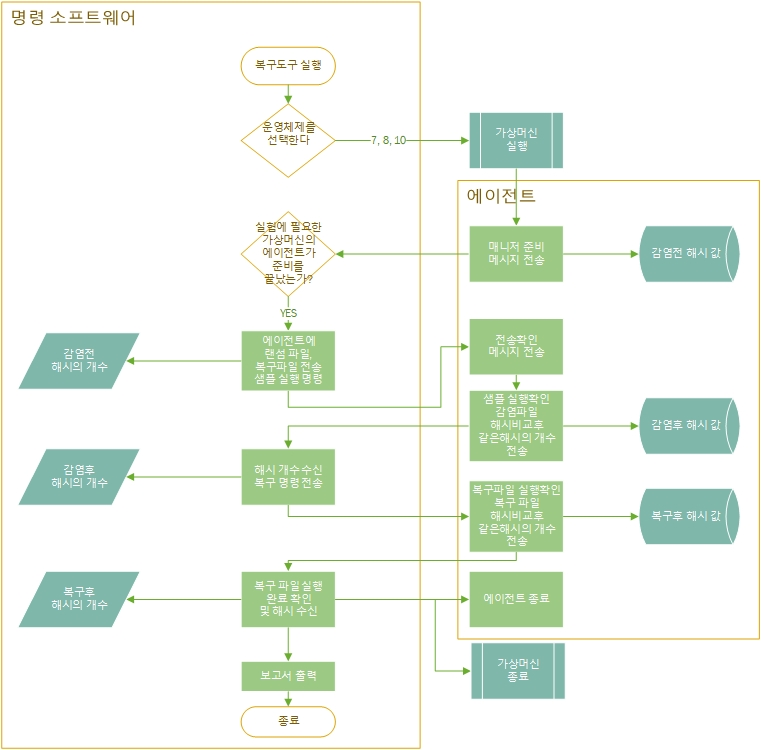
# 3. 설치전 확인해야할 것들

## 3.1 권장사양 체크
가상머신이 다중으로 기동할수 있게 하기 위해 권장되는 사양은 다음과 같습니다.

    운영체제: 윈도우® 10 64-bit
    프로세서: 인텔® Core™ i5-2500, AMD™ Ryzen 5 1400, 또는 그 외 쿼드코어 프로세서
    메모리: 8 GB RAM 또는 그 이상
    용량: 120 GB의 SSD 여유 공간
    인터넷: 외부,내부망 연결해제
    입력장치: 다중 버튼 마우스
    해상도: 최소 1920 x 1080 디스플레이 해상도

인터넷 부분은 설치 단계에서는 문제가 되지 않지만 실행 단계에서 랜섬감염을 방지해야하므로 물리적인 분리가 요구됩니다.

## 3.2 제공된 설치 파일 목록
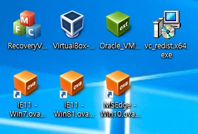

    매니저 파일 : RecoveryValidate.exe
    버츄얼 박스 설치파일 : VirtualBox-5.2.26-128414-Win.exe
    Oracle_VM_VirtualBox_Extension_Pack-5.2.26.vbox-extpack
    가상머신 이미지파일 : IE11 - Win7.ova,IE11 - Win81.ova,MSEdge - Win10.ova
    기타 파일: vc_redist.x64.exe
 파일 분실을 대비하여 링크를 추가합니다.
    
    매니저 파일 : 드롭박스링크
    버츄얼 박스 설치파일 : https://download.virtualbox.org/virtualbox/5.2.26/VirtualBox-5.2.26-128414-Win.exe
    https://download.virtualbox.org/virtualbox/5.2.26/Oracle_VM_VirtualBox_Extension_Pack-5.2.26.vbox-extpack
    기타 파일 : https://www.microsoft.com/ko-kr/download/details.aspx?id=48145

# 4. 설치 순서

## 4.1 vc_redist.x64.exe 

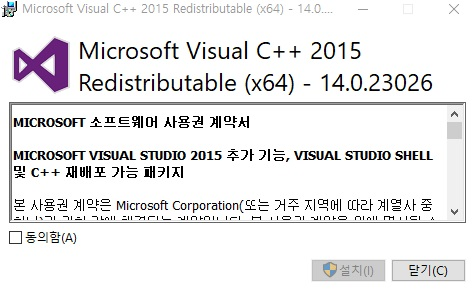

3.2 목록 사진의 첫줄 네번째 아이콘을 더블클릭합니다.
다음과 같은 화면이 나오면 동의함을 체크하고 설치합니다.

## 4.2 버츄얼박스 5.2.26버전 설치
3.2 목록 사진의 첫줄 두번째 아이콘을 더블클릭하여 실행합니다.
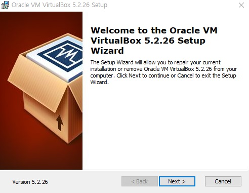

## 4.3 가상머신 이미지 등록
3.2 목록 사진의 두번째 줄 아이콘들은 가상머신 이미지 입니다. 더블클릭하여 실행하면 다음과 같은 화면이 출력됩니다.

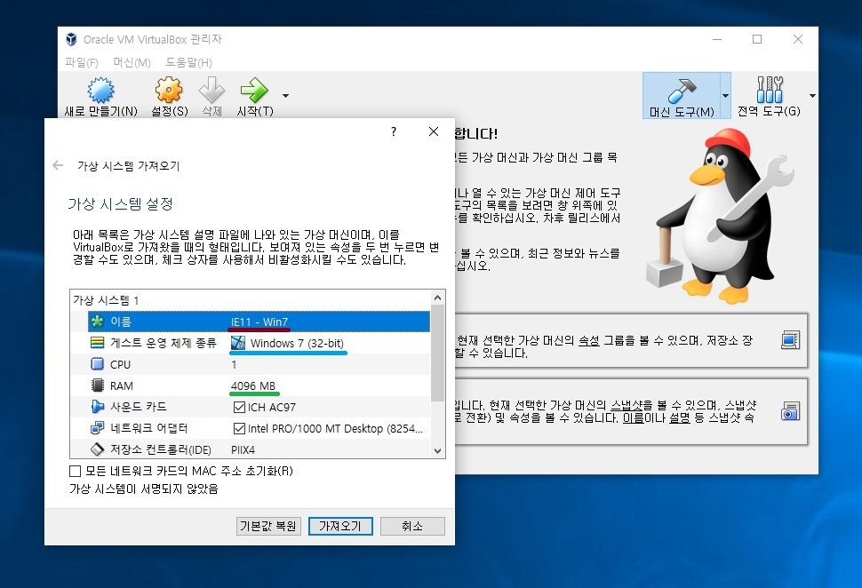
    
    빨간 밑줄친부분은 가상머신의 이름입니다.
    파란 밑줄친부분은 운영체제 정보입니다.
    초록색은 할당 메모리의 양입니다.

가상머신의 이름은 해당파일과 동일하게 순서대로 등록되야합니다. 버전별로 IE11 - Win7,IE11 - Win81,MSEdge - Win10 입니다. 임의 이름으로 변경시 혹은 순서가 달라지면 가상머신 기동에 문제가 생길수 있습니다.

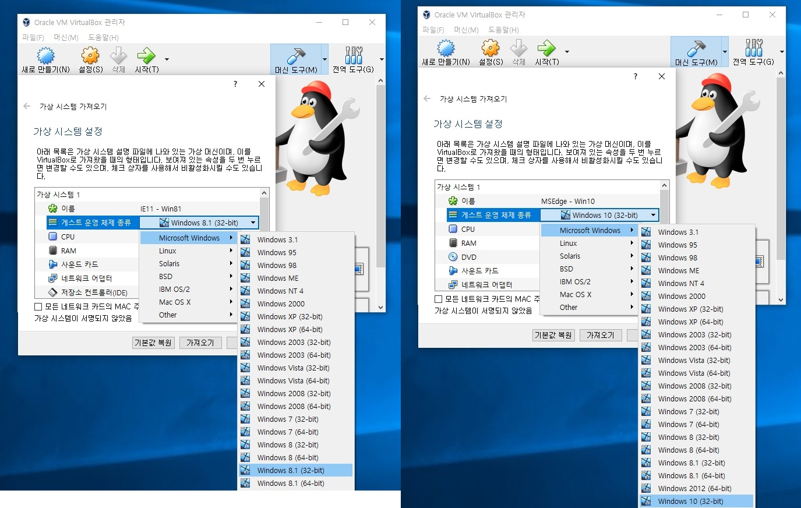

제공되는 가상머신의 운영체제는 Windows 7(32-bit), Windows 8.1(32-bit), Window 10(32-bit) 입니다.
최초 등록시 Win81과 Win10은 64비트로 설치될수 있으니 꼭 32bit로 설정합니다.

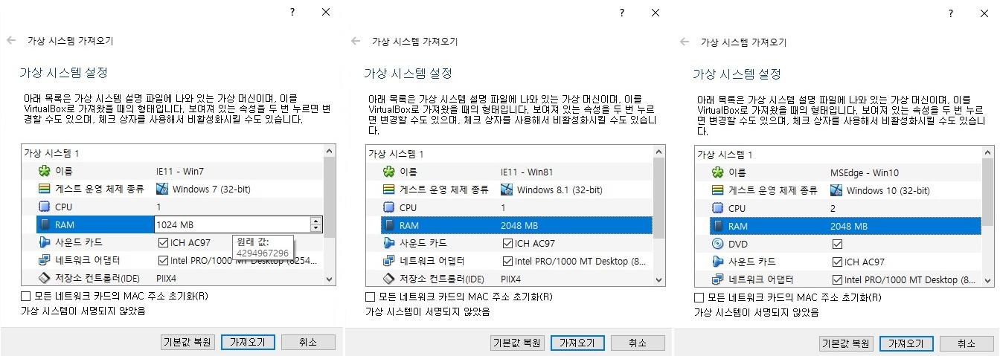

가상머신을 다중기동 하려면 다음과 최소한 다음과 같이 메모리를 할당해줘야합니다.
메모리 할당량은 IE11 - Win7.ova(1024MB), IE11 - Win81(2048MB), MSEdge - Win10.ova(2048MB) 로 설정합니다.

## 4.4 가상머신 시험 기동
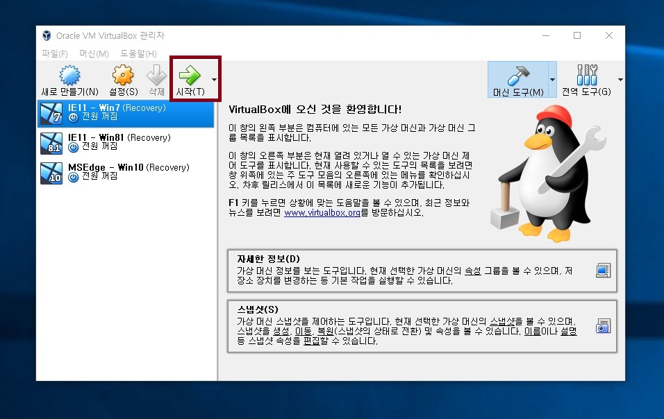

빨간 박스 영역의 시작을 눌러 등록한 가상머신들을 하나씩 기동해봅니다.

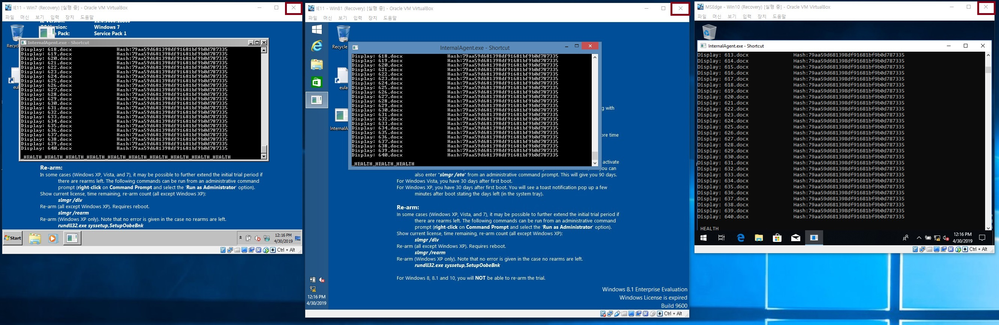

해당 화면처럼 기동되는것을 확인한후 각 가상머신 우측 상단에 붉은 상자영역에 있는 X표시를 눌러 종료합니다.

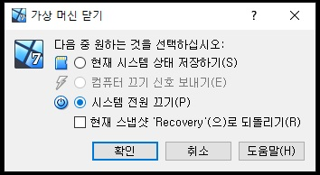

해당 윈도우 창에서 전원 끄기를 체크한 후 확인을 누릅니다.

## 4.5 네트워크 설정
가상머신과 해당 컴퓨터간의 내부 네트워크를 구성하기 위한 설정단계 입니다.

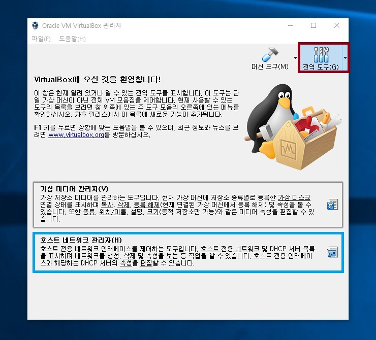

먼저 버츄얼 머신을 실행시키고 우측 빨간 박스 영역에 전역도구를 클릭합니다. 그후 하단 파란 박스 영역의 호스트 네트워크 관리자를 클릭합니다.
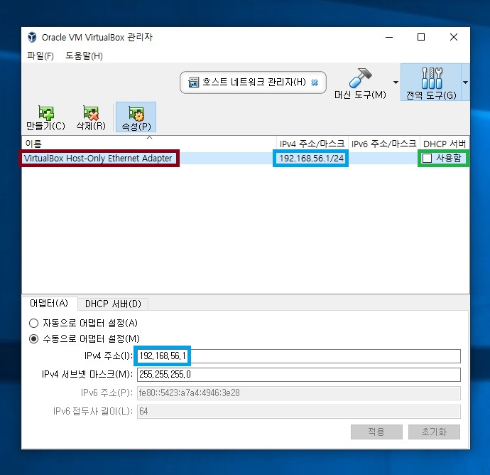

빨간 박스 안의 영역에 VirtualBox Host-Only Ethernet Adapter가 존재 하지않는다면 만드기 버튼을 눌러 생성합니다.

그 후 초록박스영역의 DHCP 서버 체크를 푼후 그림과 같이 하단 수동어뎁터 설정을 체크한다. IPv4 자리에 192.168.56.1 를 입력한후 적용버튼을 클릭하여 상단 파란박스에 변경사항이 적용됬는지 확인한다.

### 4.5.1 가상 머신별 네트워크 설정
이제 가상머신 별로 네트워크를 설정합니다.
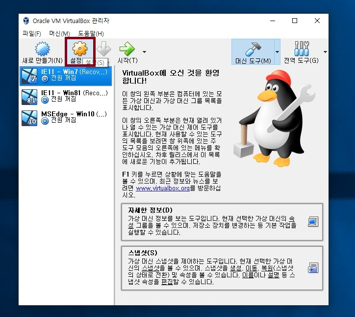

수정해야할 가상머신을 선택한후 빨간 박스영역의 설정을 클릭합니다.

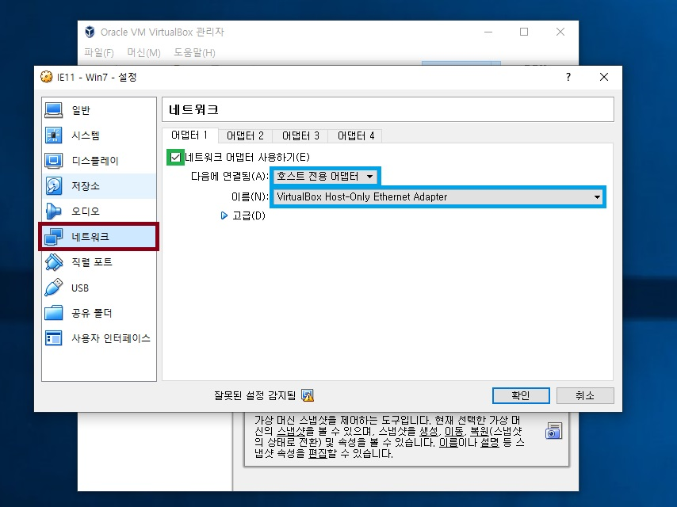

우측 네트워크 메뉴를 클릭합니다. 그후 네트워크 어뎁터 사용하기를 체크한뒤 그림과 같이 호스트 전용 어뎁터를 선택합니다. 이름은 4.5 네트워크 설정에서 등록한 이름을 선택합니다.

## 4.6 복구용 스냅샷 찍기
복구 도구는 스냅샷을 이용하여 가상머신의 초기상태로 돌아갑니다. 스냅샷은 가상머신의 순간상태를 저장하는 기능힙니다.

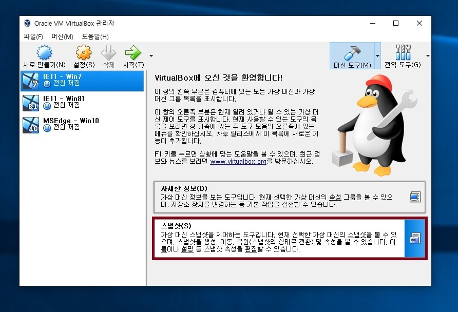

하단 빨간 박스 영역에 스냅샷을 클릭합니다.

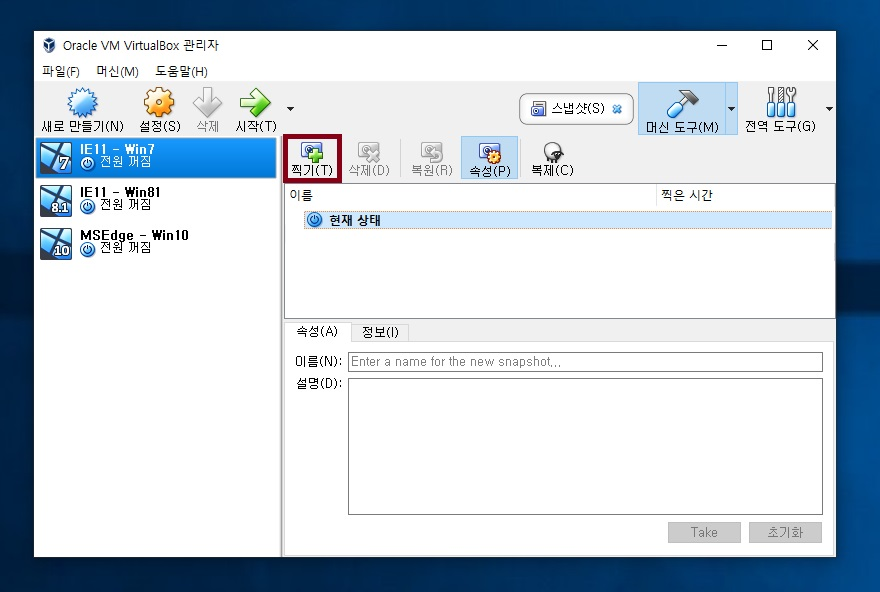

빨간 박스 영역의 찍기를 클릭합니다.

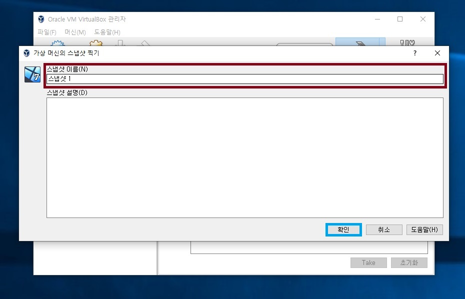

빨간 박스 영역에 이름을 INIT을 입력하고 하단에 확인을 누릅니다.
같은 방식으로 이름이 Recovery인 스냅샷을 생성합니다.

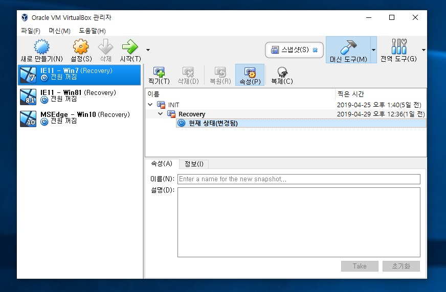

1개는 관리자용, 1개는 복구용으로 사용됩니다. Recovery 스냅샷이 손상되었을때 INIT스냅샷을 이용하여 상태를 복원할수 있습니다.

같은 방식으로 나머지 운영체제에도 스냅샷을 2개씩 생성해줍니다.

## 4.7 복구도구 검증 프로그램 시험 기동
프로그램 실행을 위한 모든준비가 됬습니다. 사용자 메뉴얼에 따라 프로그램 이 잘 작동하는지 확인합니다. 

가상머신의 이름, 스냅샷의 이름이 정확히 일치하지 않는다면 복구도구 프로그램에서 VirtualBox를 제어할수 없습니다.
